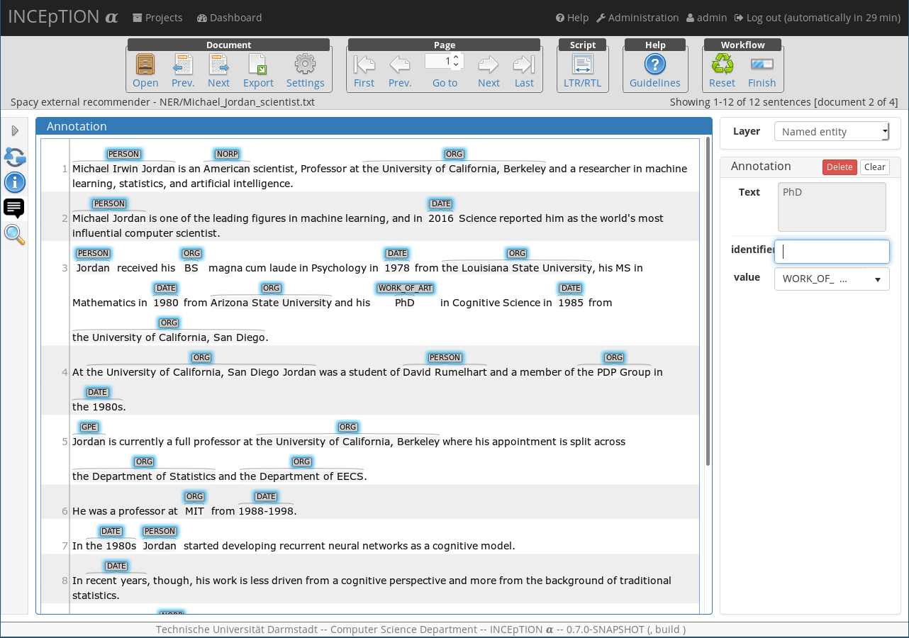
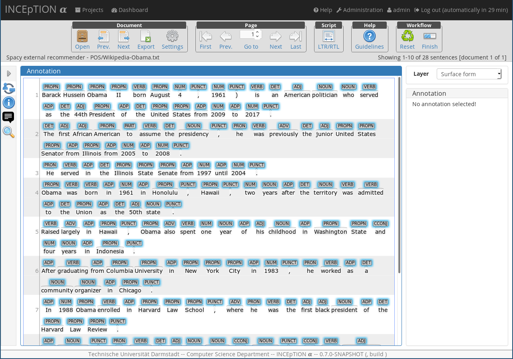

# external-recommender-spacy

This project contains an example external recommender for the [INCEpTION annotation platform](https://inception-project.github.io/). It is used to recommend possible named entities and part-of-speech tags to an annotator in order to speed up annotation and improve annotation quality. It uses [spacy](https://spacy.io/) internally to do this predictions and [Flask](http://flask.pocoo.org/) as the web framework.

The request format is described in the [INCEpTION external recommender documentation](https://inception-project.github.io//releases/0.6.1/docs/developer-guide.html#_external_recommender).

## Installation

This project uses Python ≥ 3.5, `Flask`, `spacy` and `dkpro-cassis`. It is recommended to install these dependencies in a virtual environment:

    virtualenv venv --python=python3 --no-site-packages
    source venv/bin/activate
    python -m pip install git+https://github.com/dkpro/dkpro-cassis
    pip install flask
    pip install spacy
    
`spacy` needs a pretrained model. These can be installed by issuing   
    
    python -m spacy download ${MODEL_NAME}
    
from the command line where `${MODEL_NAME}` is the name for the model. A list of pretrained models can be found on the [spacy page](https://spacy.io/usage/models#section-available). Make sure that the model has the capabillities you want, this project needs for instance by default `syntax` for tagging and `entities` for named entity recognition. The model name has then to be altered in `app.py`:

    
    nlp = spacy.load('${MODEL_NAME}', disable=['parser']) 

## Usage

After everything has been set up, the recommender then can be started from the command line by calling

    python app.py
    
When used in production, it is better to deploy this Flask project on an actual application server like [Gunicorn](https://gunicorn.org/).

## Examples

### Named entity recognition

### Part-of-speech tagging 

